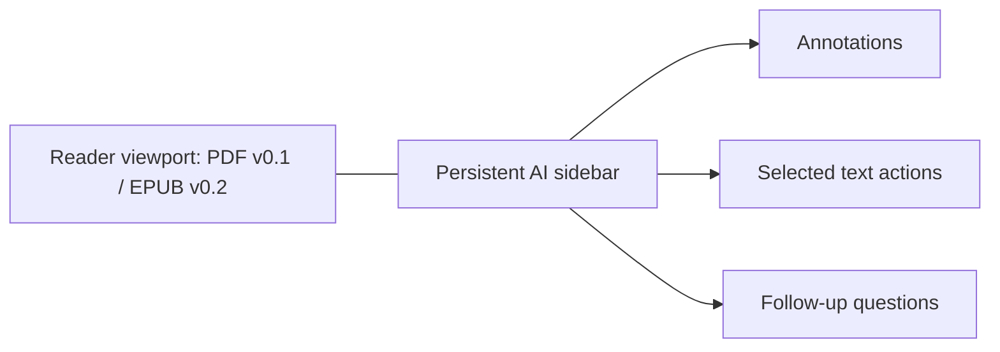
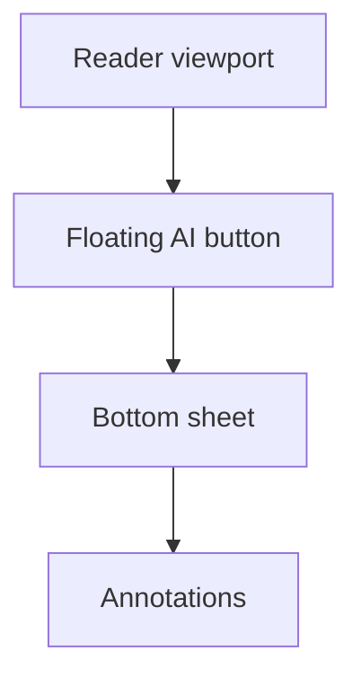

# UI Layouts

## Wide Layout



```text
┌────────────────────────────────────┬──────────────────────┐
│                                    │ AI Annotations       │
│       PDF v0.1 / EPUB v0.2         │ ───────────────────  │
│                                    │ Term                 │
│                                    │ Short explanation    │
│                                    │ Details              │
└────────────────────────────────────┴──────────────────────┘
```

## Phone Layout



```text
┌──────────────────────┐
│                      │
│ PDF v0.1 / EPUB v0.2 │
│                      │
│                 AI ○ │
└──────────────────────┘

After tapping AI:

┌──────────────────────┐
│ PDF v0.1 / EPUB v0.2 │
├──────────────────────┤
│ AI Annotations        │
│ Term / explanation    │
└──────────────────────┘
```
