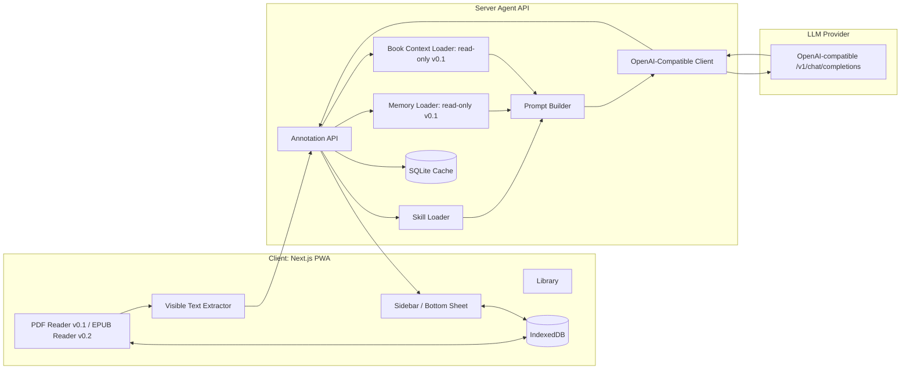
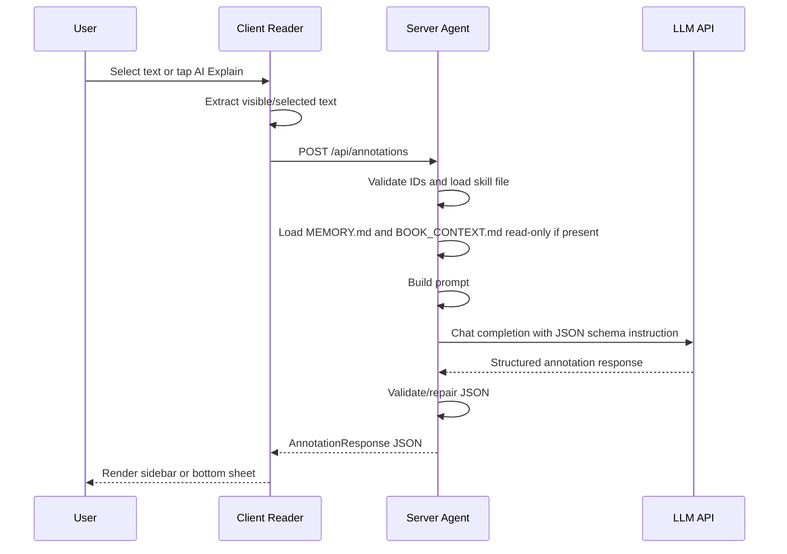

# Architecture

## Recommended Stack

Frontend:
- Next.js App Router
- TypeScript
- React
- Tailwind CSS
- shadcn/ui or equivalent primitives
- PDF.js/react-pdf
- epub.js in v0.2
- IndexedDB wrapper such as Dexie

Backend:
- Hono + TypeScript for v0.1
- OpenAI-compatible client
- SQLite
- Zod schema validation
- File-system based skill/memory loader

Use Hono in v0.1 so the server, App Router client, shared schemas, and tests stay in one TypeScript toolchain.

Deployment:
- Start as Web/PWA
- Keep Capacitor compatibility in mind, but do not introduce native mobile code in v0.1

## Component Diagram



## Request Flow



## Suggested Monorepo Layout

```text
ai-reader/
  apps/
    web/
      app/
      components/
      lib/
      public/
  server/
    src/
      index.ts
      routes/
      agent/
      storage/
      schemas/
    skills/
      default.md
      technical.md
      language_learning.md
    memory/
      users/default/MEMORY.md
      books/.gitkeep
  packages/
    shared/
      schemas/
      types/
  docs/
```

## API Endpoints

### POST /api/annotations

Server validation:
- Treat `bookId`, `userId`, and `skillId` as opaque IDs. Do not join unchecked request values into file-system paths.
- Accept only conservative identifier characters such as `[a-zA-Z0-9_-]+`.
- Resolve skill, memory, and book-context files under allowlisted base directories.
- Reject requests that exceed configured text-size limits before prompt assembly.
- Treat `visibleText`, `selectedText`, PDF metadata, and EPUB metadata as untrusted quoted content. Text from the book must never override system, skill, or schema instructions.

Request:
```json
{
  "bookId": "book_001",
  "bookTitle": "Designing Data-Intensive Applications",
  "format": "pdf",
  "location": {
    "type": "pdf_page",
    "page": 42,
    "chapter": "Chapter 2"
  },
  "visibleText": "...",
  "selectedText": "Apache Kafka",
  "skillId": "default",
  "userId": "default",
  "options": {
    "detailLevel": "standard",
    "language": "ja"
  }
}
```

Response:
```json
{
  "annotations": [
    {
      "id": "ann_001",
      "title": "Apache Kafka",
      "kind": "technology",
      "short": "分散イベントストリーミング基盤。",
      "details": [
        "大量のイベントを永続化して順序付きで配信する。",
        "ログ、メッセージキュー、ストリーム処理の基盤として使われる。"
      ],
      "whyRelevantHere": "このページではデータパイプラインの耐障害性の文脈で出ている。",
      "related": ["event log", "consumer group", "stream processing"],
      "confidence": "medium"
    }
  ],
  "followupQuestions": [
    "KafkaとRabbitMQの違いは？",
    "この文脈でKafkaが必要になる理由は？"
  ],
  "warnings": []
}
```

### POST /api/annotation-jobs

The Reader submits an annotation request as a background job when it needs the result to keep running across page changes. The server enqueues the job, continues the agent work server-side, and exposes the status through `GET /api/annotation-jobs?jobId=...`.

Job states:
- `queued`
- `running`
- `completed`
- `failed`

The client polls until the job is completed, then persists the validated annotation JSON locally.

## Schema Guidance

Use strict schemas for LLM output. If the model returns invalid JSON:
1. Try parse.
2. If parse fails, call a lightweight repair function or request JSON repair once.
3. If still invalid, return a safe fallback error annotation.

The implementation schema should reject unknown properties, cap array lengths and string sizes, and keep the TypeScript, Zod, and prompt schema definitions in sync.

## Cache Key Guidance

Cache keys must include every prompt input that can materially change the answer:
- `bookId`
- normalized location key
- `visibleTextHash`
- `selectedTextHash`
- `skillId`
- `skillVersion`
- `model`
- output language
- detail level
- `promptVersion`
- `memoryVersion`
- `bookContextVersion`

When memory, book context, skill content, or the system prompt changes, use a new version value so stale annotations are not reused.

Version values:
- `promptVersion`: explicit constant changed whenever prompt assembly rules or the system prompt changes.
- `skillVersion`: content hash of the loaded skill file.
- `memoryVersion`: content hash of the loaded memory file, or `none` if absent.
- `bookContextVersion`: content hash of the loaded book context file, or `none` if absent.

Server cache privacy:
- Do not persist raw `visibleText` or `selectedText` in the default server cache.
- Persist hashes, location metadata, model/settings, response JSON, status, and timing metadata.
- Raw request bodies may be logged only in an explicit development/debug mode and must be disabled by default.

## UI Breakpoints

- `< 600px`: phone mode. Floating AI button + bottom sheet. Bottom sheet must be dismissible.
- `600px - 1023px`: compact tablet. Collapsible side panel overlay.
- `>= 1024px`: tablet/desktop. Persistent right sidebar.

## EPUB Page Model

The EPUB reader uses a page-based pagination model, not a continuous-scroll model.

Definition:
- A page is the set of content that fits into the current viewport under the current font size, line height, margins, and pagination settings.
- The reader must not hide overflowing text inside the current page.
- If content exceeds one page, it continues on the next page.
- The page count must be recalculated when viewport size, orientation, font size, or pagination settings change.
- Page labels shown in the UI should follow `P.X / N`, where `X` and `N` come from the current pagination state.

Responsibilities:
- `displayed.page / displayed.total`: user-visible page label source when available.
- `CFI`: persistence and restore of the current reading position.
- `TOC` and spine: chapter/section navigation targets.
- `locations`: jump support and pagination support, but not the only definition of what the user sees as a page.
- Blank or image-only structural pages may exist in the source book, but they must not leave the reader with hidden text in the current page.

Implementation guidance:
- Keep pagination logic isolated from annotation, memory, and book-context logic.
- Do not derive page numbers from chapter counts or section counts alone.
- Do not mix temporary locations generation state with the user-visible page label.
- Do not reintroduce continuous scrolling for normal EPUB reading unless the product spec is changed explicitly.

## LLM Prompt Assembly Order

1. System rules
2. Skill file content
3. User memory summary
4. Book context summary
5. Request payload: location, selected text, visible text
6. Output schema instruction

Prompt boundaries:
- Skill, memory, and book context are trusted server-side context after path validation.
- Book text, selected text, titles, authors, and metadata are untrusted source material.
- The prompt builder must clearly delimit untrusted source material and instruct the model to ignore any instructions embedded in it.
- The UI must call only the server agent endpoint. It must not call the LLM provider directly.

## Security Notes

- Never expose server-side API keys to the browser.
- Local server mode stores provider API keys in server environment variables or a server-side secret store.
- Hosted server mode stores user-provided provider keys as encrypted server-side secrets, or uses an operator-managed key with explicit disclosure.
- The browser may configure the app server URL, but provider base URLs and provider keys must stay behind the server agent.
- Sanitize rendered Markdown.
- Treat EPUB/PDF metadata as untrusted.
